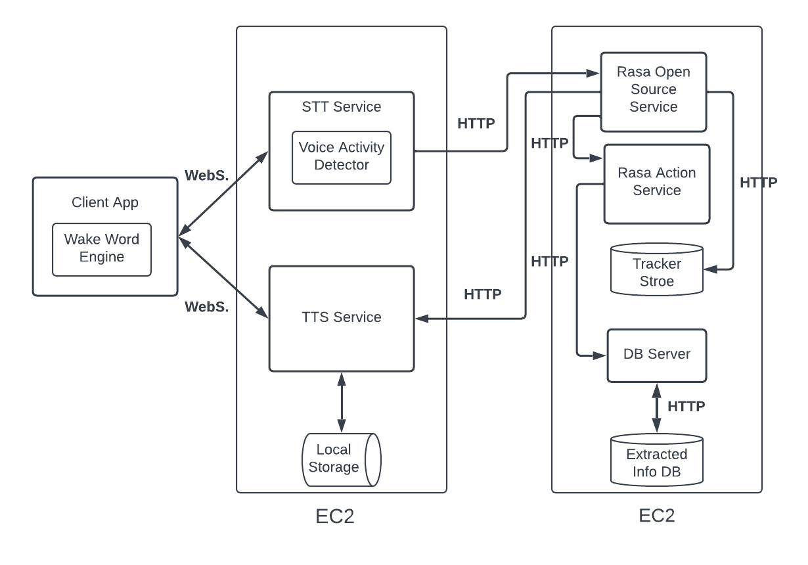

# Lucy 🤖👩‍💻
## _Say Lucy, I have a great feature!_

Lucy is a domain independent voice-based chatbot that can interview stockholders to elicit new requirements in the context of crowd-based requirements engineer (CrowedRE).

Lucy is my final year project (bachelor), so it is still a prototype :) 

- Fully open-source
- Trained on open-source data sets
- Supports voice-first user interface design
- Modular and expandable

## Features

- Conducting simple requirements elicitation interviews
- Domain independent
- Named entitiy recognition and extracting of stackholders information and new requirments
- Works best with requiremnts that follows user story format (_see below for more info_)


## Tech

Lucy uses a number of open source projects:

- [Rasa] - An open source framework for chatbot development
- [Vosk] - Awesome text to speech (STT) library  
- [Coqui] - A toolkit for speech synthesising
- [Flutter] - To build amazing apps
- [Silero] - Very usful Voice Activity Detector VAD
- [Porcupine] - The wake word enigne of choice!

## Architecure
The system architecture follows a client-server model, with a thin client. Further, the
backend of the system consists of multiple services hosted on the cloud, representing a
simplified microservices architecture.
Because the backend exposes two WebSocket API endpoints, any client can utilize this
backend, not only the client app discussed here.
An architecture diagram of the system is depicted below:




## Functionality

#### Client App and STT service
Lucy is designed to carry out a short interview and to start by introducing herself and her capabilities, and then she continues asking about the stakeholder and their role and experience with the software. She then explains what user stories and ask the interviewee if they have any user story or a feature to share and how important this feature is. 

User stories are a way to describe features, and they have a simple structure. Because the voicebot is domain independent and it is rather challenging to capture all types of natural language descriptions of a requirement. It was more feasible to train the language model with tagged user stories data. It is enough for the user to state the feature as a wish (I want, I would love to have, I need) and it is not necessary to give the whole user story. 

The client app, which is a Flutter app that can be run on iOS and android devices. 
The user would initiate a WebSocket connection to the STT and TTS services running in the backend using their unique id, to be able to send and receive voice data. 
 The client app manages how the voice data is being captured and played using the correct sample rate. The app also runs a wake word engine called  
Porcupine, which is open source. The wake word engine makes it possible for Lucy to be activated when the user utters the special wake word "say Lucy". 
The user utterance is streamed in real time to the STT service to be transcribed. The communication between the client and services and between services themselves happens through events, which are represented as Json objects. Such an event is for example: 
```python
'''{"event":"disconnect", "user_id": "$id", "reason":"close connection"}'''
```

The stt service, which is running as a python WebSocket server, receives the voice data as bytes and feed them directly to an open source stt engine called VOSK to be transcribed to text in real time. 

Vosk offers an API and pre-trained models for the more famous KALDI speech recognition tool kit. 

The bytes stream is also saved to an in-memory buffer and then when a specific threshold is reached, the received bytes are fed to a machine learning-based voice activity detector, which monitors the voice stream for the existence of human speech, and when no human speech is being detected anymore, it immediately triggers a timer which, after a couple of seconds:  

1- podcast an event to the client app to shut down the voice stream.\
2- and at the same time it sends the last version of the transcribed user utterance to the Rasa Open-source service to be further processed.   

The models for vosk and Silero are open source and freely available. 

#### Rasa
Rasa Open source is a framework for developing contextual chatbots. It consists of two parts. One is the NLU pipeline and the other is the Dialog manager. We can think about the Rasa component as the brain of the voicebot.  

The NLU pipeline is a combination of processing steps that convert user messages into intents and entities. The intent and entity recognizers used in the pipeline are the DIETclassifier (based on transformer architecture) provided by Rasa for intent classification and entity extraction, and  SpacyEntityExtractor spyce library.  

The DIETclassifer is trained on thousands of sentences representing multiple user intents and containing examples for the entities that should be extracted from the user answers. The data was partly open-source data which, was cleaned and tagged by me (the scripts are in the data) and other data which is generated through simulated interaction with the voicebot.  
The SpacyEntityExtractor is pretrained and is solely being used to extract one entity "DATE". 

After the NLU components predicted the intent of a user message, the dialog management component takes this prediction and the state of the conversation and predicts the next action. To train the dialog manager a so-called story approach is followed, where various interaction scenarios or stories are given as steps in YAML format -example- to train them. A rule-based approach is also followed with some simple rules like (if user greets, greet back, etc.) 

The entity extraction is done automatically by RASA, and it is then validated in a special component called the Rasa Action Server, where some heuristics are applied to validate if the correct entity has been correctly extracted. Upon validating the extracted entities, they are sent to a DB server to be saved to a MongoDB database, under the ID of the user.  
The Rasa Open-Source service then send the right response to the TTS service, to be turned into voice and sent back to the client app. The conversation log is saved after every interaction to a MongoDB database. 

#### TTS Service
The TTS server is a python webserver built with Sanic, which is a HTTP server that offers HTTP responses via asynchronous request handling (fast), and it also has WebSocket support. The TTS processing is done using Coqui which is a spin-off project that continue the work of Mozilla open TTS project, which is not maintained anymore. Coqui offers pre-trained models. 

Because some of the voicebot responses are the same for all the interviews (like asking how you are), these responses have been generated beforehand and are saved as static files to the TTS server with a special naming convention. To save resources and not to generate them every time. Upon receiving the voicebot response, the TTS service checks whether the response should be generated in real time, and then send it via WebSocket to the client app. 

The client app "play" the voicebot voice, and the cycle continue until the end of conversation is reached. The voicebot will then say goodbye and a new conversation can be started again. 

## Installation

The following components are included in this guide: 

	1- the stt_service 
	2- the tts_service 
	3- the rasa_bot 
	4- the flutter_app 
	5- the db_server 
Please make sure to install the required dependencies for every component before running the code. 
The following dependencies are needed, if the code doesn’t compile, please check for missing dependencies and check the version of Python/ Dart / Flutter that you have. 
For 1 please check: https://alphacephei.com/vosk/ \
For 2 please check: https://github.com/coqui-ai/TTS \
For 3 please check: https://rasa.com/docs/rasa/docker/building-in-docker/  \
For 4 please check: https://docs.flutter.dev/get-started/install \
-------------------------------------------------------------------------------------------------------------- 
The service should be initiated in this order: 
Tts_service -> db_server / MongoDB -> rasa_action_server -> rasa_core -> stt_service -> the flutter app. 
--------------------------------------------------------------------------------------------------------------- 
the stt_service: 
To run the stt_service after installing all the needed dependencies, please download the desired data set and place it in the same folder as the script. 
----------------------------------------------------------------------------------------------------------------- 
For running the Flutter app and using the wake word, you must have an access key from  
https://pub.dev/packages/porcupine_flutter/versions/2.0.1 
---------------------------------------------------------------------------------------------------------------- 
For Rasa you can use the provided link to run it in container and use the trained model in the model folder.
[The Rasa trained model files can be downloaded from here](https://drive.google.com/file/d/1JgUUmdJ58FRxCUvQgiGzBajCbYCN5syj/view?usp=sharing)
---------------------------------------------------------------------------------------------------------------- 

## License

MIT

**Free Software, Hell Yeah!**

[//]: # (These are reference links used in the body of this note and get stripped out when the markdown processor does its job. There is no need to format nicely because it shouldn't be seen. Thanks SO - http://stackoverflow.com/questions/4823468/store-comments-in-markdown-syntax)

   [Rasa]: <https://rasa.com/>
   [Vosk]: <https://alphacephei.com/vosk/>
   [Coqui]: <https://github.com/coqui-ai/TTS>
   [Flutter]: <https://flutter.dev/>
   [Silero]: <https://github.com/snakers4/silero-vad>
   [Porcupine]: <https://picovoice.ai/docs/api/porcupine-flutter/>


